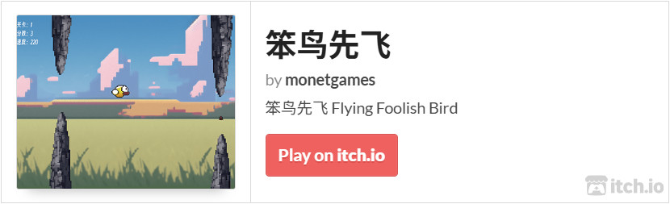

# 笨鸟先飞

《笨鸟先飞》是参考《Flappy Bird》而设计的，是从零开始自学游戏开发过程的第一款游戏，用于熟悉 Godot 游戏引擎和验证独立游戏开发技术、美术等方面可行性。

## 试玩

## 文档

* [开源独立游戏《笨鸟先飞》 1 游戏设计](./docs/FlyingFoolishBird1.md)
* [开源独立游戏《笨鸟先飞》 2 美术、音效、字体](/docs/FlyingFoolishBird2.md)
* [开源独立游戏《笨鸟先飞》 3 程序开发](./docs/FlyingFoolishBird3.md)

## 关于

微信公众号：莫奈奈。

