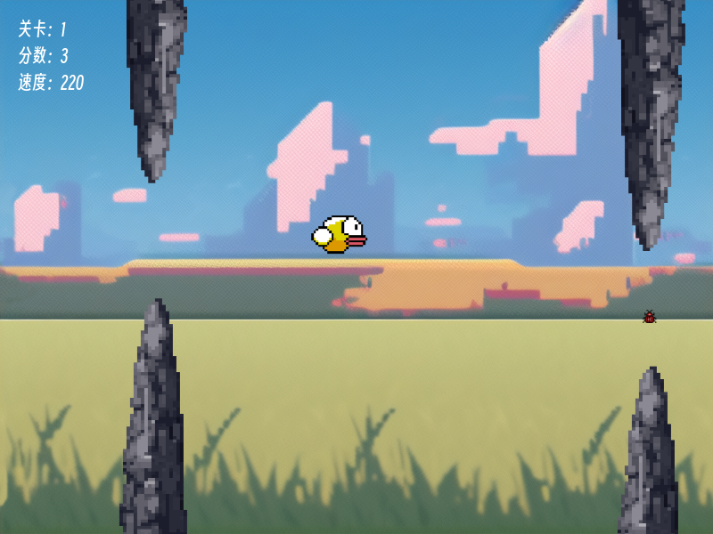

# 开源独立游戏《笨鸟先飞》 1 游戏设计

## 背景

《飞翔的小鸟》（Flappy Bird）是一款简单休闲的手机游戏，以其极具挑战性和上瘾性的玩法而爆火。其玩法是通过点击操控小鸟飞行且避开障碍物，如果小鸟飞过一组障碍物则玩家加一分，直到小鸟碰到了障碍物则游戏结束。

《笨鸟先飞》是参考《飞翔的小鸟》而设计的，是从零开始自学游戏开发过程的第一款游戏，用于熟悉 Godot 游戏引擎和验证独立游戏开发技术、美术等方面可行性。其包括程序、美术等资源完全开源（遵循 MIT 开源许可协议）。

## 游戏设计

### 主题
勤能补拙。

### 故事
一年一度的飞行大赛开始了！作为一只名不见经传的菜鸟，你深知自己天赋平平，唯一的信条就是“笨鸟先飞”。你必须提早练习，在险峻的岩石赛道中穿梭，通过捕食昆虫来激发潜能、提升速度，击败所有看似不可能的困难，最终一飞冲天，震惊全场！

### 玩法
玩家操控小鸟上下左右飞行且避开岩石，吃虫子提高飞行速度；通过若干岩石组成的关卡则游戏胜利，碰到岩石则游戏结束。

### 机制
* **小鸟（玩家）**：使用键盘上下左右操控小鸟上下左右飞行，无操控不会下坠。
* **虫子（敌人）**：虫子在每组岩石之间；小鸟吃虫子提高飞行速度。
* **岩石（障碍物）**：每组（上下）岩石之间的空隙高度固定；小鸟无碰撞飞过岩石则加一分；存在若干关卡，每个关卡中岩石组（左右）的间隔和移动速度固定；随着关卡难度提高，岩石组的间隔越小、移动速度越快。

### 美术
* **角色/物体**：使用 Aseprite 软件和 pixellab (AIGC) 插件绘制像素风图片和动画。
* **背景**：使用 Stable Diffusion (AIGC) 生成有草原、蓝天、白云的像素风图片。
* **UI**：使用 Godot 引擎通用 UI。

### 技术
使用 Godot 引擎 4.4 版本与 GDScript 脚本语言开发。

### 音效
使用 Mubert (AIGC) 生成积极、节奏稍快且带有循环感的背景音乐和游戏成功与失败的音效。