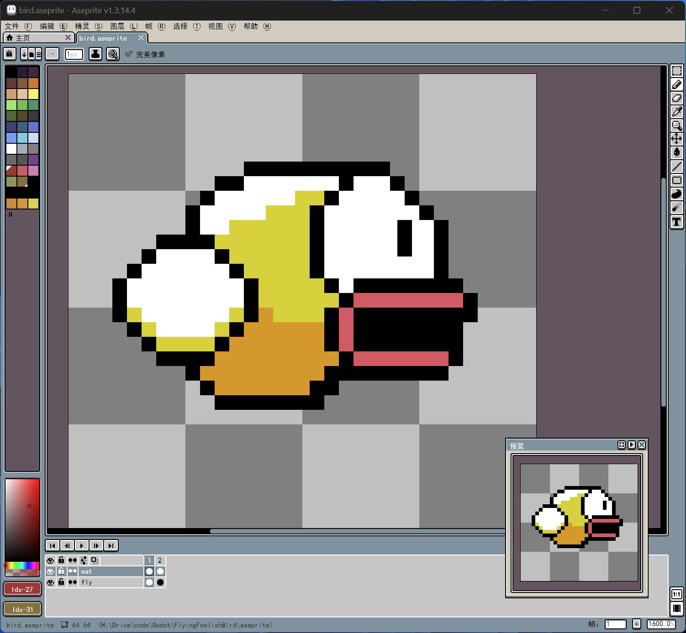
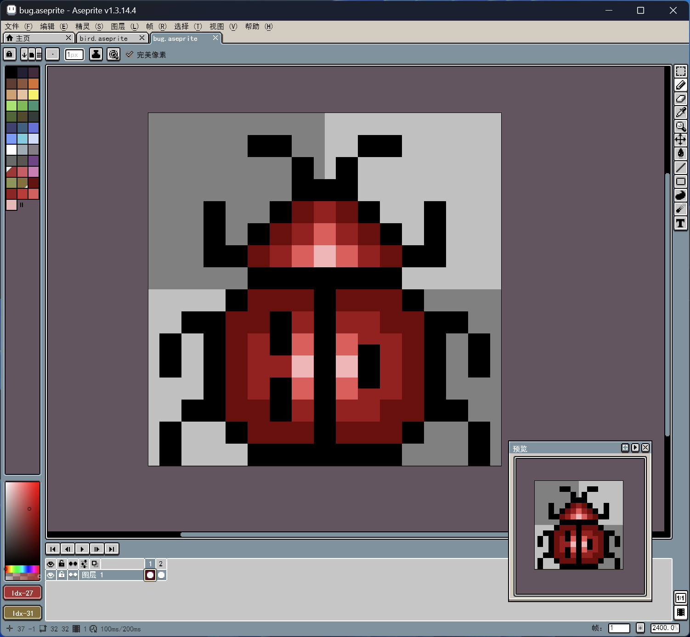
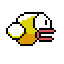
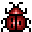
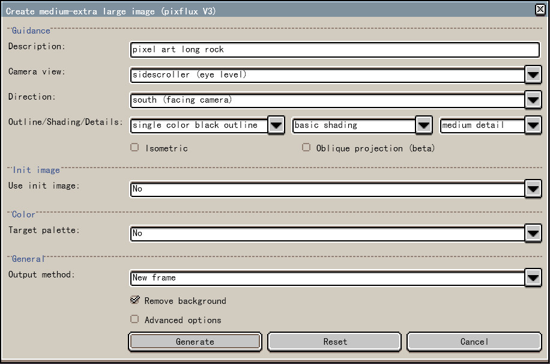
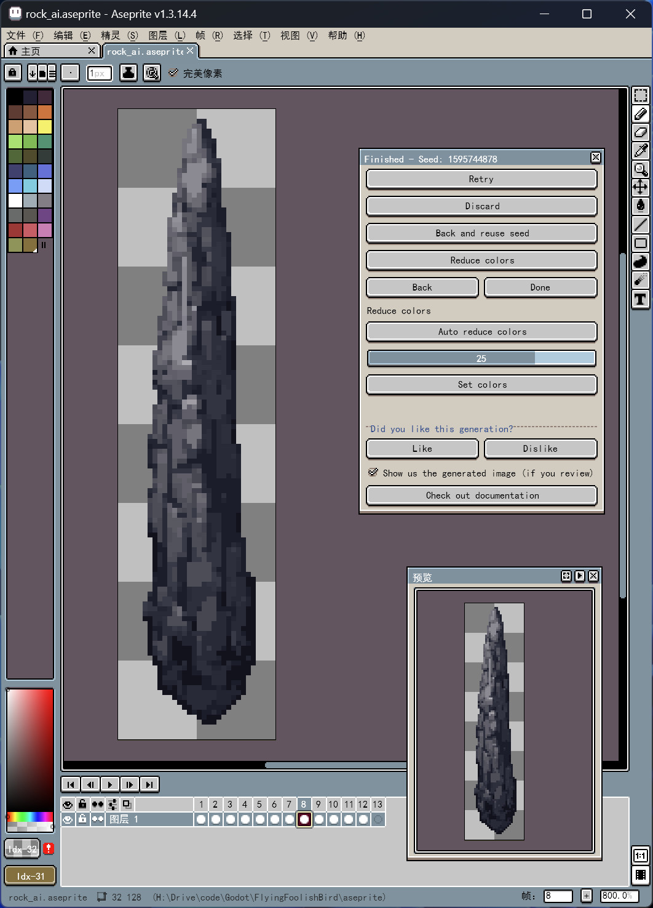
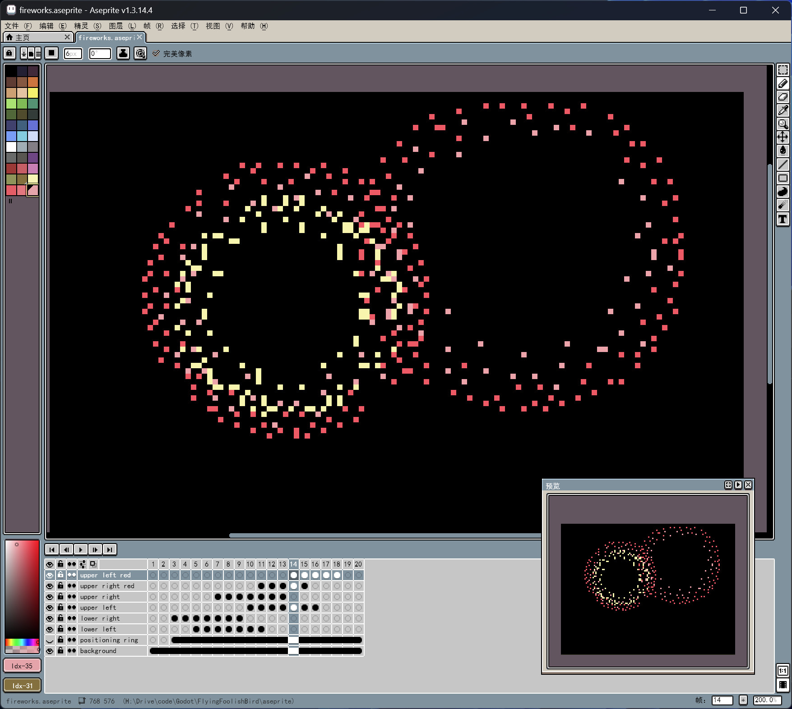
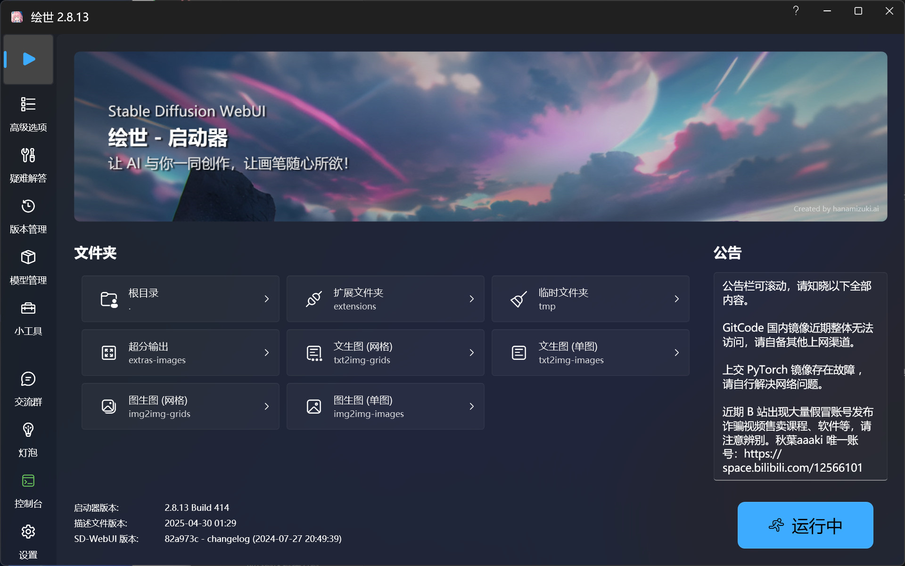
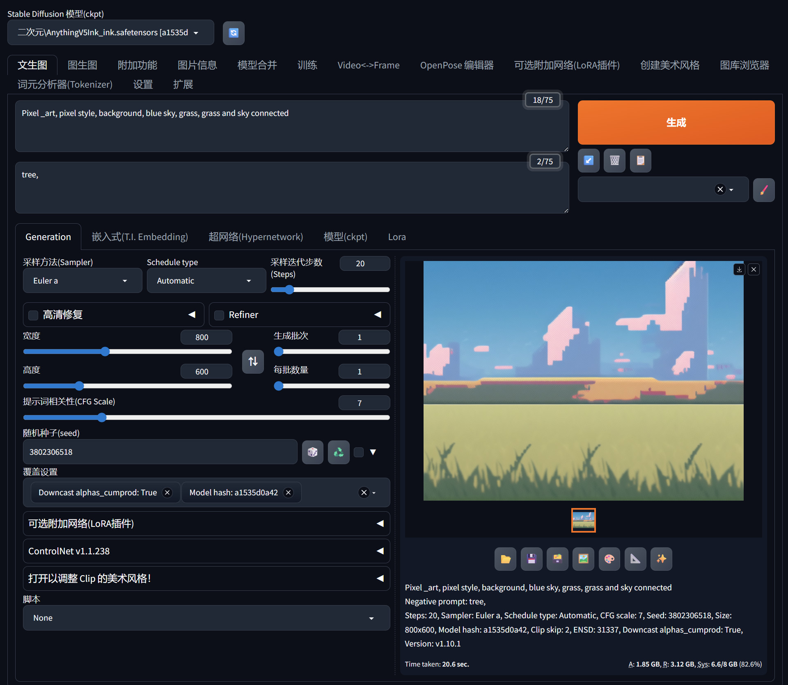
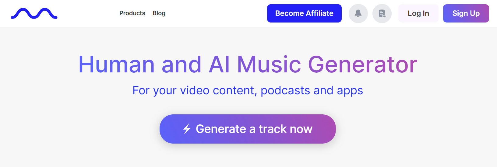

# 开源独立游戏《笨鸟先飞》 2 美术、音效、字体

## 美术

**Aseprite** 是一款简单易用的开源图像编辑器，主要用于像素绘画和动画。其官网是 <https://www.aseprite.org>。

我们用它来制作像素风的游戏角色（小鸟、虫子）、物体（岩石）、特效（烟花动画）。其中的岩石尝试使用 Aseprite 的一款插件 PixelLab 来 AI 生成。

**PixelLab** 官网是 <https://www.pixellab.ai/>，安装说明见：<https://www.pixellab.ai/docs/installatio>。

### 角色

游戏角色有小鸟（Bird）和虫子（Bug），需制作两帧的简单动画让他们动起来。在 Aseprite 按 `Tab` 键调出动画帧视图，完成角色绘制后复制到下一帧，进行简单修改（如小鸟通过上下煽动翅膀而形成上下飞的动画。）形成下一帧。

小鸟和虫子的动画效果。

### 物体

游戏物体（岩石）只需单帧的图片即可，所以尝试使用 PixelLab 插件来 AI 生成。

在插件中使用文生图 `Create image` - `Create M_XL image (new)`，Description 中输入提示词 `pixel art long rock`，点击 Generate 生成。重复尝试几次，选择合适的素材保存。

### 特效

游戏后期难度很高，玩家经过紧张刺激的游戏过程，达成游戏胜利后，需要给予玩家轻松、积极的反馈，增强游戏体验。即使是个小小游戏。

因此，需要设计一个简单的特效（烟花动画）。

我们还是使用 Aseprite 来绘制多帧的烟花动画。烟花的爆炸是环状散开，中间亮度高、时间短，散开成圈，逐渐暗淡，同时伴随些许下降。通过这些特性绘制一个爆炸区，然后复制成四个不同时间爆炸的动画。最后对大烟花增加红色环状效果。

烟花动画（增加纯黑背景的）实际效果。

### 背景

因游戏是试验性质的，游戏背景不使用 PixelLab 生成，而是使用 AI 文生图模型 Stable Diffusion，搭配 **秋葉aaaki** 的 Stable Diffusion WebUI 整合包。

使用 `AnythingV5Ink_ink.safetensors` 模型，下载网页 <https://civitai.com/models/9409?modelVersionId=90854>。

输入提示词 `Pixel _art, pixel style, background, blue sky, grass, grass and sky connected`，设置参数，多次尝试，生成合适素材。

## 音效

**Mubert** 是一个 AI 音乐生成器的网站，也是属于人工智能生成内容（AIGC），通过提示词或图片生成音乐。其官网是 <https://mubert.com/>。

我们用它来生成游戏音效（背景音乐、游戏胜利和失败的提示音）。

## 字体

游戏字体使用 Github 开源的 **得意黑** 字体。

其是一款在人文观感和几何特征中寻找平衡的中文黑体，官网是 <https://atelier-anchor.com/typefaces/smiley-sans/>。