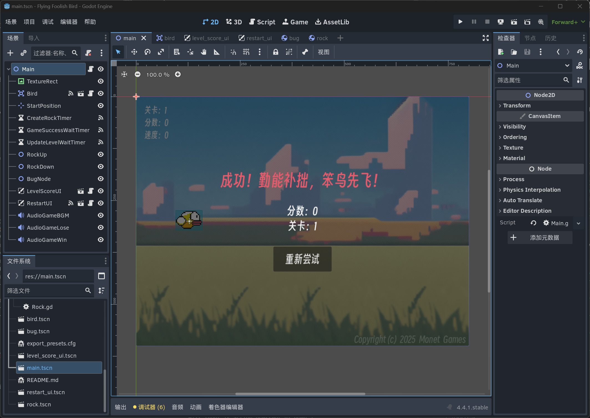

# 开源独立游戏《笨鸟先飞》 3 程序开发

游戏使用 **Godot** 引擎 4.4 版本与 **GDScript** 脚本语言开发。



## 角色和物体

### 小鸟 Bird

Bird 节点为 `Area2D` 类型，使用 `AnimatedSprite2D` 承载帧动画，可接收 `body_entered` 信号判断碰到的对象。

```GDScript
# 鸟碰到 body
func _on_bird_body_entered(body):
	if body.get("object_type") != null:
		# 鸟碰到了岩石，游戏结束
		if body.object_type == "Rock":
			game_over(false)
		# 鸟碰到了虫子，吃虫子
		elif body.object_type == "Bug":
			eat_bug(body)
```

接受键盘输入操控小鸟飞行。

```GDScript
func _process(delta):
	var velocity = Vector2.ZERO
	if Input.is_action_pressed("ui_up"):
		velocity = Vector2.UP * bird_speed
	elif Input.is_action_pressed("ui_down"):
		velocity = Vector2.DOWN * bird_speed
	elif Input.is_action_pressed("ui_left"):
		velocity = Vector2.LEFT * bird_speed
	elif Input.is_action_pressed("ui_right"):
		velocity = Vector2.RIGHT * bird_speed
		
	position += velocity * delta
	position.x = clamp(position.x, 0, screen_size.x)
	position.y = clamp(position.y, 0, screen_size.y)
```

### 虫子 Bug

Bug 节点为 `RigidBody2D` 类型，使用 `AnimatedSprite2D` 承载帧动画，接收 `VisibleOnScreenNotifier2D` 信号自动销毁。

```GDScript
func _on_visible_on_screen_notifier_2d_screen_exited():
	queue_free()
```

每个 Bug 有 `bug_id` 标记。
### 岩石 Rock

Rock 节点为 `RigidBody2D` 类型，使用 `Sprite2D` 装载图片，接收 `VisibleOnScreenNotifier2D` 信号自动销毁。

```GDScript
func _on_visible_on_screen_notifier_2d_screen_exited():
	# 延迟销毁，避免边缘还未离开屏幕就销毁
	await get_tree().create_timer(0.5).timeout
	queue_free()
```

每对 Rock 有 `rock_pair_id` 标记。

## UI

### 重启UI restart_ui

restart_ui 节点为 `CanvasLayer` 类型，文字按钮使用 `VBoxContainer`、`MarginContainer`  布局，使用 `% 作为唯一名称访问`，游戏胜利时的烟花动画使用 `AnimatedSprite2D` 承载。

增加游戏成功与失败的激励语。

```GDScript
const win_msg_array = ["成功！勤能补拙，笨鸟先飞！","成功！眼疾手快，熟能生巧！","成功！振翅破风云，终成翱翔者！"]
const lose_msg_array = ["笨鸟先飞，多试必达。","屡败屡战，终将先飞。","差之毫厘，下次翱翔。"]

func _ready():
	randomize()
	
func update_result(is_success):
	if is_success:
		$%"ResultMessageLabel".text = win_msg_array[randi() % 3]
		$%"FireworksAnimation".play()
	else:
		$%"ResultMessageLabel".text = lose_msg_array[randi() % 3]	
```

## 主逻辑

### 开始与结束游戏

通过槽函数连接更新 UI、关卡、音乐等信号。

游戏开始时初始化、启动计时器等待生成岩石对。

游戏结束时重置、销毁对象。

```GDScript
func _ready():
	randomize()
	# 信号槽
	self.sig_update_score.connect($RestartUI.update_score)
	self.sig_update_level.connect($RestartUI.update_level)
	self.sig_result.connect($RestartUI.update_result)
	self.sig_update_score.connect($LevelScoreUI.update_score)
	self.sig_update_level.connect($LevelScoreUI.update_level)
	self.sig_update_bird_speed.connect($LevelScoreUI.update_bird_speed)
	self.sig_update_level.connect(_on_update_level)
	$AudioGameBGM.finished.connect(_on_audio_game_BGM_finished)
	
	# 开始游戏
	start_game()

# 游戏开始
func start_game():
	is_game_playing = true
	print("main start_game")
	rock_pair_passed_id = 0
	rock_pair_num = 0
	bug_num = 0
	set_score(0)
	set_level(1)
	set_bird_speed(default_speed)
	$RestartUI.hide()
	$Bird.start($StartPosition.position)
	$AudioGameBGM.play()
	$CreateRockTimer.start()
	
# 游戏结束
func game_over(is_success):
	is_game_playing = false
	print("main ganme_over")
	emit_signal("sig_result", is_success)
	$AudioGameBGM.stop()
	if is_success:
		$AudioGameWin.play()
	else:
		$AudioGameLose.play()
	$RestartUI.show()
	$Bird.die()
	$CreateRockTimer.stop()
	for item in $RockUp.get_children():
		item.queue_free()
	for item in $RockDown.get_children():
		item.queue_free()
	for item in $BugNode.get_children():
		item.queue_free()
```

### 更新分数、游戏通关判断

每组岩石对有其 id，id 依次增大，如果小鸟通过的岩石对 id 大于其最后通过的岩石对 id，则加一分。

当累计通过的岩石对数达到总岩石对数时视为通关。

```GDScript
func _physics_process(delta):
	if is_game_playing:
		# 遍历上面的岩石数组
		for rock_pair in $RockUp.get_children():
			# 如果当前岩石id大于最后通过的岩石id，并且当前岩石被鸟飞过去了，则加一分
			if rock_pair.rock_pair_id > rock_pair_passed_id and rock_pair.position.x < $Bird.position.x:
				# 更新鸟最后通过的岩石id
				rock_pair_passed_id = rock_pair.rock_pair_id
				# 更新分数
				set_score(score + 1)

				# 游戏通关判断：当累计通过的岩石对数达到总岩石对数时视为通关
				var total_rock_pairs = rock_time_array.size() * each_level_rock_pair_num
				if score >= total_rock_pairs:
					$GameSuccessWaitTimer.start()
					return

				# 若处于“已生成完本关岩石，等待关卡切换”的状态，并且小鸟已经通过了本关最后一对岩石，
				# 同时关卡间暂停计时器也已到（level_pause_over），则在此处完成关卡切换并继续生成下一关
				if is_waiting_level_transition and rock_pair_passed_id >= current_level_last_rock_id and is_level_pause_over:
					_start_next_level()
```

### 生成岩石对、关卡切换

使用生成岩石计时器（`CreateRockTimer`），每间隔若干秒动态生成岩石对（`create_rock_pair`），统一由 `CreateRockTimer` 的 `timeout` 信号生成，保持同一关每组岩石对间隔一致。

生成每个关卡最后一个岩石对时停止生成岩石计时器（`CreateRockTimer`）生成岩石对，等待小鸟通过关卡的最后一个岩石对，则启动关卡切换等待计时器（`UpdateLevelWaitTimer`），等待若干秒后再启动生成岩石计时器（`CreateRockTimer`）生成下一关的岩石对。

```GDScript
# 数组size等于关卡数，数组每项代表每一关生成岩石的间隔时间
const rock_time_array = [3, 2.4, 1.9, 1.5, 1.2, 1, 0.8, 0.7]

# 用于关卡之间等待逻辑
var is_waiting_level_transition = false # 等待关卡切换状态
var is_level_pause_over = false		# 关卡间暂停计时器结束
var current_level_last_rock_id = 0	# 当前关卡最后一对岩石id

# 生成岩石对（上下各一个岩石）、虫子
func create_rock_pair():
	# 生成岩石对
	var rock_up_y = randf_range(-168, 192)
	var rock_down_y = rock_up_y + 576
	var velocity = Vector2(-cur_rock_speed, 0.0)
	rock_pair_num = rock_pair_num + 1

	var rock_up = rock_scene.instantiate()
	rock_up.rotate(3.14)
	rock_up.position = Vector2(880, rock_up_y)
	rock_up.set_linear_velocity(velocity)
	rock_up.rock_pair_id = rock_pair_num
	$RockUp.add_child(rock_up)

	var rock_down = rock_scene.instantiate()
	rock_down.position = Vector2(880, rock_down_y)
	rock_down.set_linear_velocity(velocity)
	rock_down.rock_pair_id = rock_pair_num
	$RockDown.add_child(rock_down)
	
	# 生成虫子
	var bug_y = rock_up_y + randf_range(220, 360)
	bug_num = bug_num + 1
	var new_bug = bug_scene.instantiate()
	new_bug.born(bug_num, Vector2(880, bug_y))
	new_bug.set_linear_velocity(velocity)
	$BugNode.add_child(new_bug)

# 调整关卡难度
func _on_update_level(value):
	if value < 1:
		return
	var create_rock_wait_timer = rock_time_array[value-1]
	$CreateRockTimer.wait_time = create_rock_wait_timer

	# 难度调整拟合函数
	cur_rock_speed = 470 - 95 * create_rock_wait_timer

# 在条件满足时开始下一关
func _start_next_level():
	# 若不是处于等待过渡状态，直接返回（防止重复调用）
	if not is_waiting_level_transition:
		return

	# 立即清理等待状态，防止再次触发
	is_waiting_level_transition = false
	is_level_pause_over = false

	# 停止关卡等待计时器（若仍在运行）
	if $UpdateLevelWaitTimer.is_stopped() == false:
		$UpdateLevelWaitTimer.stop()

	# 更新关卡（若尚未到最大关）
	if level < rock_time_array.size():
		set_level(level + 1)

	# 由 CreateRockTimer 统一生成下一关的岩石对
	if $CreateRockTimer.is_stopped():
		$CreateRockTimer.start()

# 计时器 CreateRockTimer 的 timeout 信号
func _on_create_rock_timer_timeout():
	# 总共需要生成的岩石对数
	var total_rock_pairs = rock_time_array.size() * each_level_rock_pair_num

	# 如果已生成完所有关卡的岩石对，则停止
	if rock_pair_num >= total_rock_pairs:
		$CreateRockTimer.stop()
		return

	# 统一由 CreateRockTimer 生成岩石对（先生成，再判断是否到达本关生成上限）
	create_rock_pair()

	# 若刚生成后达到了本关该生成的数量（即每关已生成完），则暂停生成并等待关卡更新
	if rock_pair_num % each_level_rock_pair_num == 0:
		$CreateRockTimer.stop()
		# 标记当前关最后一对岩石 id，并进入等待状态（等待 UpdateLevelWaitTimer 完成以及鸟通过）
		current_level_last_rock_id = rock_pair_num
		is_waiting_level_transition = true
		is_level_pause_over = false
		$UpdateLevelWaitTimer.start()


# 计时器 UpdateLevelWaitTimer 的 timeout 信号
func _on_update_level_wait_timer_timeout() -> void:
	# 如果已生成完所有关卡岩石对，不再重启生成计时器
	var total_rock_pairs = rock_time_array.size() * each_level_rock_pair_num
	if rock_pair_num >= total_rock_pairs:
		return

	# 只标记关卡间暂停已结束，不直接改关卡（因为小鸟可能尚未飞过本关最后一对岩石）
	is_level_pause_over = true

	# 如果小鸟已飞过本关最后一对岩石，则在此处立即开始下一关
	if is_waiting_level_transition and rock_pair_passed_id >= current_level_last_rock_id:
		_start_next_level()
```
